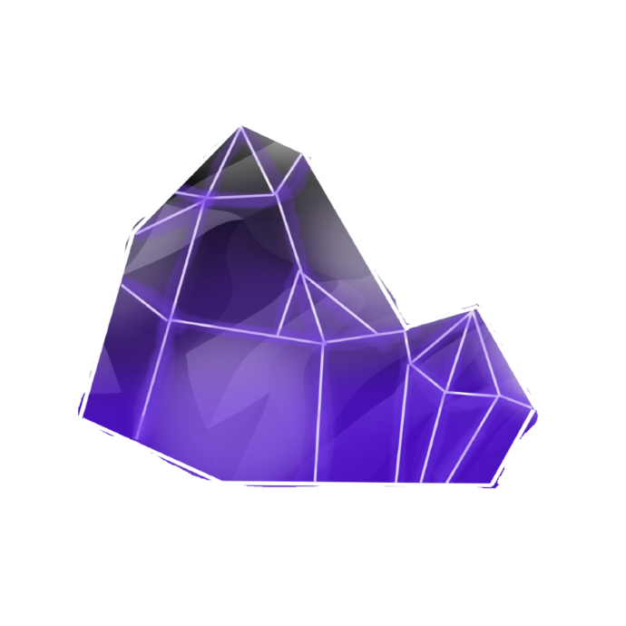

<div align="center">
    <h1 style="font-size: large; font-family: 'Segoe UI', Tahoma, Geneva, Verdana, sans-serif;">
        <a href="https://itzispyder.github.io/" style="color:rgb(0, 149, 149); font-size: 40px;">
            
            Visit my github page!
        </a>
    </h1>
</div>


# Hello there! I'm ImproperIssues!

```java
while(alive) {
  wakeUp();
  eat();
  code();
  minecraft();
  beBased();
  sleep();
}
```


### I am a small creator!
- I am a small beginner plugin creator
- I love working with java in my free time
- I am still learning java
- I love talking and meeting new people! Feel free to dm me.

### My Links 
- `Discord` ImproperIssues#4988
- `Github` [https://github.com/ItziSpyder](https://github.com/ItziSpyder)
- `SpigotMC` [https://www.spigotmc.org/members/itzispyder.1635590/](https://www.spigotmc.org/members/itzispyder.1635590/)
- `Linktree` [https://linktr.ee/ItziSpyder](https://linktr.ee/ItziSpyder)
- `My Discord Server` [https://discord.gg/pmsas6yeCN](https://discord.gg/pmsas6yeCN)


### Recent Projects
- [CombatUtils](https://github.com/ItziSpyder/CombatUtils) - *Based Server-Side Utilities for Your Minecraft Server*
- [UniVault](https://github.com/ItziSpyder/UniVault) - *Universal Vaults for Infinite Storage, Kit and NBT submission ETC*
- [AntiMinehut](https://github.com/ItziSpyder/AntiMinehut) - *Disable, Remove, Delete... We are against Minehut's ram-costing forced plugins!*
